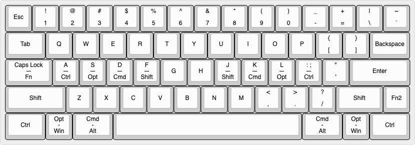
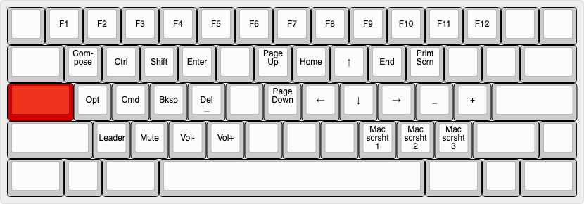

# ohshitgorillas' 60% Layout

This is the page for my custom 60% layout code.

It's used for two of my four keyboards:
- Luminkey LX60
- KBDfans Tofu60 2.0

### Luminkey LX60 Copper Edition


- **Color**: Anodized green
- **Accent Bar**: Copper
- **Keycaps**: CannonKeys British Racing Green
- **Artisan**: Gary Green Jasper by KeycapQuarry
- **Switches**: Invokeys Matcha Reserve
- **Plate**: PP
- **Mounting**: 30A O-ring
- **Foams**: None
- **Mods**:
    - **Feet**: Herbie's Grungebuster pads w/ adhesive
    - Heavily force break modded

### Tofu60 2.0


- **Color**: E-Coating Black
- **Keycaps**: Geekark Black-on-Black
- **Switches**: HMX Retro R
- **Plate**: PC
- **Mounting**: Silicon socks
- **Foams**: None
- **Mods**:
    - **Feet**: Herbie's Grungebuster pads w/ adhesive
    - Taped up flex cuts on PCB

## Base Layer


**Legend**: Short dashes "-" indicate OS-specific differences, with macOS on top and Windows on bottom. Longer em-dashes "—" indicate a tap-hold configuration, with the tap function on top and hold on the bottom.

The base layer features:
- A standard QWERTY layout.
- Split Backspace for HHKB-like access to `\|` and `` `~ `` on the top row, moving Backspace down to above Enter.
- A Caps Lock key that serves double duty as access to the main function layer.
- Split right Shift for an HHKB-like `Fn2` key for access to a second function layer.
- Home Row Modifiers (HRMs)

## Caps Lock Layer


The Caps Lock Layer (CLL) is the primary function layer for the board, providing access to:
- F-keys
- Compose and Leader
- Navigation keys
- Quick access to frequently typoed symbols (`_` and `+`) used for coding.
- Volume control
- Screenshotting functions

It also brings core features and modifiers to within reach of the left hand entirely, eliminating the need for repetitive motions of the right hand between the mouse/nav keys and, e.g., Backspace or Enter.

The use of the Caps Lock key here provides ergonomic and extremely fast access to the layer.


### Left-Handed Features
The most valuable aspect of the CLL is bringing essential modifiers and navigation keys—Backspace, Enter, and Delete—within comfortable reach of the left hand, eliminating the need for awkward right-hand stretches.

Consider deleting the previous word with a traditional keyboard layout:
- Stretch your left hand down to the bottom corner for Ctrl or Opt
- Reach your right hand up to Backspace with your pinky

Compare this to the streamlined CLL approach:
- Press Caps Lock with your left pinky
- Hold `a` (macOS: Opt, Windows: Ctrl) and tap `d` (Backspace)

This method is not only faster and more comfortable, but also keeps your hands in their natural positions, dramatically reducing strain during extended typing sessions.

### The Taming of Caps Lock as a Dual-Use Key
On the surface, there are two conflicting timing requirements at work here:
- On macOS, the operating system prevents Caps Lock from being toggled with hold times under 200ms.
- Due to its ideal position on the home row, the CLL's Backspace and Delete functions can be accessed at extreme speeds, often under 50ms, demanding an extremely short tapping term and aggressive tap-hold rules.

Further complicating matters are the presence of Home Row Modifiers, which require completely distinct, vastly more conservative timing principles to avoid misfires (assuming one does not wish to use home-row Shift as their primary Shift key).

The following table compares the timing requirements for both HRMs and the CLL:

| Feature | HRMs | CLL | Notes |
|---------|------|-----|-------|
| Tapping term | Default (200ms) | Very short | |
| `CHORDAL_HOLD` | ✓ | ✗ | Successfully prevents HRM same-hand misfires, however, we *want* same-hand activation to be easy for CLL |
| Tap-hold decision behavior | Default (most conservative) | `HOLD_ON_OTHER_KEYPRESS` (most aggressive) | For HRMs, we want to require the entire hold duration (default behavior) to prevent misfires; for CLL, if we are pressing another key, it's probably intended as a hold/layer action |
| `RETRO_TAPPING` |  ✗  |  ✓  | For HRMs, we want to have ample time to make our selection; for the Caps Lock key, this enables far more reliable activation |
| `FLOW_TAP` | ✓ | Not a flow tap key by default | This feature further prevents HRM misfires by disabling 'hold' functionality on tap-hold keys mid-typing flow

It is possible to accommodate both HRMs and CLL on the same keyboard, and to 'tame' the Caps Lock key as a dual-use tap-hold key, but it requires the full force of QMK's timing arsenal. The key features are:
- `TAPPING_TERM`: This is the crux of all tap-hold functionality. See [the official QMK Tapping Term documentation](https://docs.qmk.fm/tap_hold#tapping-term) for more information.
- `HOLD_ON_OTHER_KEYPRESS`: This instructs QMK that if we're pressing another key at the same time as a tap-hold key, to interpret the keypress as a hold regardless of the tapping term.
- `RETRO_TAPPING`: This tells QMK that if we haven't pressed any other keys by the time we release the tap-hold key, to interpret the keypress as a tap regardless of the tapping term.

First, we need to enable these features in `config.h`:
```c
#define CHORDAL_HOLD
#define FLOW_TAP_TERM 150
#define TAPPING_TERM_PER_KEY
#define HOLD_ON_OTHER_KEY_PRESS_PER_KEY
#define RETRO_TAPPING_PER_KEY
#define TAP_HOLD_CAPS_DELAY 200  // suggested for macOS
```

Next, in `keymap.c`, we need to define the per-key features:

```c
bool get_hold_on_other_key_press_per_key(uint16_t keycode, keyrecord_t *record) {
    switch (keycode) {
        case LT(2,KC_CAPS):  // macOS CLL
        case LT(3,KC_CAPS):  // Windows CLL
            return true;
        default:             // home row mods
            return false;
    }
}

uint16_t get_tapping_term(uint16_t keycode, keyrecord_t *record) {
    switch (keycode) {
        case LT(2,KC_CAPS):
        case LT(3,KC_CAPS):
            return 50;       // this may take some fine tuning
        default:
            return 200;      // the default value
    }
}

bool get_retro_tapping(uint16_t keycode, keyrecord_t *record) {
    switch (keycode) {
        case LT(2,KC_CAPS):
        case LT(3,KC_CAPS):
            return true;
        default:
            return false;
    }
}
```

Lastly, we need to disable `CHORDAL_HOLD` for the Caps Lock key, otherwise this feature could actively hold back same-hand combos like Caps Lock + `d` for Backspace. This is most easily done in `keyboard.json`: go to the first layout in the list (the handedness function only looks at the first layout), find the Caps Lock key's position, and set `hand` to `*`:

```c
{ "matrix": [2, 0], "x": 0, "y": 2, "w": 1.75, "hand": "*"},
```

That's it! Now your Caps Lock key functions perfectly both on tap and extremely fast holds.


## HHKB-style Layer


This layer is a modified version of the traditional HHKB function layer. While the right-hand features and top row remain identical to the original HHKB layout, the left-hand side has been customized:
- Volume controls have been relocated from ASD (their position in the standard HHKB layout) to XCV for better mnemonics.
- One-shot modifiers have been placed along the left-hand home row to facilitate easier chording with navigation keys.
- The 'Leader' key has been assigned to the Tab position.

In practice, this layer sees far less use than the Caps Lock Layer. The CLL above proves far more ergonomic and accessible for most tasks. However, this layer remains valuable for single-handed navigation scenarios, right-handed access to Delete, and provides easier access to lower (left-handed) F-keys compared to using Caps Lock as the modifier.
