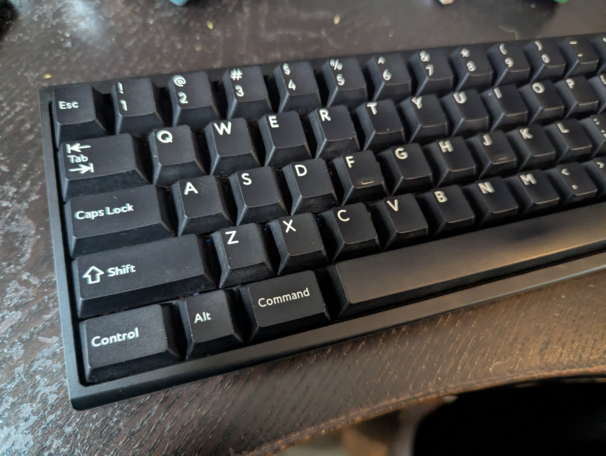
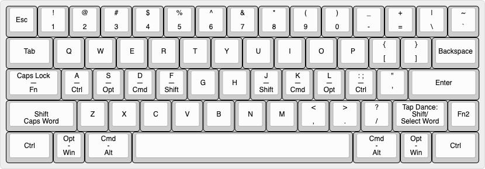
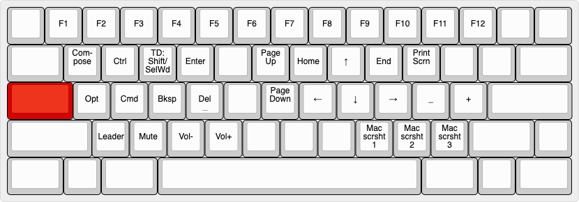

# ohshitgorillas' 60% Layout

This README provides a deep dive into my custom 60% layout, covering the hardware, design philosophy, and advanced QMK features.

It's used for two of my four keyboards:
- Luminkey LX60
- Alchemy Al.6

LX60 photo by Discord user SolidBrain.

## Keyboards
The below layout applies to the following keyboards:

### Luminkey LX60 Copper Edition
This is my main keyboard which sees 90% of my use time.


- **Color**: Anodized green w/ copper accent bar
- **Keycaps**: CannonKeys British Racing Green
- **Artisan**: Gary Green Jasper by KeycapQuarry
- **Switches**: Invokeys Matcha Reserve
- **Spacebar Switch**: Gateron Slate w/ Matcha Reserve spring
- **Plate**: Copper (Geon Venom 60HE)
- **Mounting**: 45A GraveShift O-ring
- **Stabilizers**: WS OA Mint Green (Enter, left Shift) and Typeplus x YiKB (spacebar)
- **PCB**: wired hotswap
- **Foams**: None
- **Mods**: 
    - **Feet**: Herbie's Grungebuster dots w/ adhesive
    - Heavily force break modded

### Qwertykeys Neo60 Cu
This is my primary tactile board.


- **Color**: Purple (aluminum anodized)
- **Keycaps**: Custom one-of-a-kind "Mineralogy" set from Yuzu, dye-sub PBT
- **Artisan**: Charoite from KeycapQuarry
- **Switches**: BSUN Hutt
- **Spacebar Switch**: Wuque Studio Heavy Tactile
- **Plate**: Alu
- **Mounting**: Gasket
- **Stabilizers**: TypePlus x YiKB
- **PCB**: wired solder
- **Foams**: None

### Bowl Keyboards Vella60 Performance Edition
This is my backup tactile board.

- **Color**: Black aluminum anodized w/ black carbon fiber accents
- **Keycaps**: PBTfans Lyla (blanks)
- **Switches**: BSUN Ocean
- **Spacebar Switch**: BSUN Hutt
- **Plate**: Carbon fiber
- **Mounting**: 40A GraveShift O-ring
- **Stabilizers**: Durock v3
- **PCB**: wired solder Zed60
- **Foams**: None
- **Mods**: Feet replaced w/ Herbie's Grungebuster dots w/ adhesive

### Alchemy CNC Al.6
This is my backup board.



- **Color**: Anodized black, battle-hardened weight
- **Foams**: None
- **Mods**: 
    - **Feet**: Herbie's Grungebuster dots w/ adhesive

The Al.6 has two configurations:

**Al.6 Configuration 1: Tactile**
- **Keycaps**: Drop MT3 White-on-Black
- **Switches**: Invokeys Hojicha Reserve
- **Spacebar Switch**: BSUN Hutt w/ Hojicha Reserve spring
- **Plate**: FR4
- **Mounting**: 65A GraveShift O-ring
- **Stabilizers**: WS Stupid clip-ins
- **PCB**: Bastion60 solder

**Al.6 Configuration 2: Tactile 2**
- **Keycaps**: PBTfans White-on-Black
- **Switches**: Gateron x Sillyworks SLAY Type S
- **Plate**: Alu
- **Mounting**: 60A GraveShift O-ring
- **Stabilizers**: TX AP clip-ins
- **PCB**: Bastion60 hotswap


## Base Layer


**Legend**: Short dashes "-" indicate OS-specific differences, with macOS on top and Windows on bottom. Longer em-dashes "—" indicate a tap-hold configuration, with the tap function on top and hold on the bottom.

The base layer features:
- A standard QWERTY layout.
- Split Backspace for HHKB-like access to `\|` and `` `~ `` on the top row, moving Backspace down to above Enter.
- A Caps Lock key that serves double duty as access to the main function layer.
- Split right Shift for an HHKB-like `Fn2` key for access to a second function layer.
- Caps Word (capitalize the next word only) on double tap left Shift
- Home Row Modifiers (HRMs)

## Caps Lock Layer


The Caps Lock Layer (CLL) is the primary function layer for the board, providing access to:
- F-keys
- Compose and Leader
- Navigation keys
- Quick access to frequently typoed symbols (`_` and `+`) used for coding.
- Volume control
- Screenshotting functions

It also brings core features and modifiers to within reach of the left hand entirely, eliminating the need for repetitive motions of the right hand between the mouse/nav keys and, e.g., Backspace or Enter.

The use of the Caps Lock key here provides ergonomic and extremely fast access to the layer.

### Left-Handed Features
The CLL's primary benefit is bringing essential functions—Backspace, Enter, and Delete—within comfortable reach of the left hand. This eliminates awkward right-hand stretches and minimizes hand movement.

Consider deleting the previous word with a traditional keyboard layout:
- Stretch your left hand down to the bottom corner for Ctrl or Opt
- Reach your right hand up to Backspace with your pinky

Compare this to the streamlined CLL approach:
- Press Caps Lock with your left pinky
- Hold `a` (macOS: Opt, Windows: Ctrl) and tap `d` (Backspace)

This method is not only faster and more comfortable, but also keeps your hands in their natural positions, dramatically reducing strain during extended typing sessions.

Note that "delete previous word" uses different modifiers across operating systems: Opt+Backspace on macOS versus Ctrl+Backspace on Windows/Linux. To maintain consistent word deletion behavior with the `d` and `f` keys, the layout swaps Opt on `a` with Ctrl when switching to Windows/Linux. This change may affect other workflows, such as moving lines in VS Code, which now uses Alt on `s` instead of Opt on `a`.

Note that `TD:Shift/SelWd` is a Tap Dance key which uses [Pascal Getreuer's Select Word module](https://getreuer.info/posts/keyboards/select-word/index.html):
- Selects the current word on double tap.
- Selects the current line on triple tap.
- Acts as Shift otherwise.

## HHKB-style Layer


This layer is a modified version of the traditional HHKB function layer. While the right-hand features and top row remain identical to the original HHKB layout, the left-hand side has been customized:
- Volume controls have been relocated from ASD (their position in the standard HHKB layout) to XCV for better mnemonics.
- One-shot modifiers have been placed along the left-hand home row to facilitate easier chording with navigation keys.
- The 'Leader' key has been assigned to the Tab position.

In practice, this layer sees far less use than the Caps Lock Layer. The CLL above proves far more ergonomic and accessible for most tasks. However, this layer remains valuable for single-handed navigation scenarios, right-handed access to Delete, and provides easier access to lower (left-handed) F-keys compared to using Caps Lock as the modifier.

## The Taming of Caps Lock as a Dual-Use Key
Using Caps Lock as a fast layer-tap key while preserving its standard tap behavior presents a significant technical challenge:
- On macOS, the operating system prevents Caps Lock from being toggled with hold times under 200ms.
- Due to its ideal position on the home row, the CLL's Backspace and Delete functions can be accessed at extreme speeds, often under 50ms, demanding an extremely short tapping term and aggressive tap-hold rules.

Further complicating matters are the presence of Home Row Modifiers, which require completely distinct, vastly more conservative timing principles to avoid misfires (assuming one does not wish to use home-row Shift as their primary Shift key).

The following table compares the timing requirements for both HRMs and the CLL:

| Feature | HRMs | CLL | Notes |
|---------|------|-----|-------|
| Tapping term | Default (200ms) | Very short | |
| `CHORDAL_HOLD` | ✓ | ✗ | Successfully prevents HRM same-hand misfires, however, we *want* same-hand activation to be easy for CLL |
| Tap-hold decision behavior | Default (most conservative) | `HOLD_ON_OTHER_KEYPRESS` (most aggressive) | For HRMs, we want to require the entire hold duration (default behavior) to prevent misfires; for CLL, if we are pressing another key, it's probably intended as a hold/layer action |
| `RETRO_TAPPING` |  ✗  |  ✓  | For HRMs, we want to have ample time to make our selection; for the Caps Lock key, this enables far more reliable activation |
| `FLOW_TAP` | ✓ | Not a flow tap key by default | This feature further prevents HRM misfires by disabling 'hold' functionality on tap-hold keys mid-typing flow

It is possible to accommodate both HRMs and CLL on the same keyboard, and to 'tame' the Caps Lock key as a dual-use tap-hold key, but it requires the full force of QMK's timing arsenal. The key features are:
- `TAPPING_TERM`: This is the crux of all tap-hold functionality. See [the official QMK Tapping Term documentation](https://docs.qmk.fm/tap_hold#tapping-term) for more information.
- `HOLD_ON_OTHER_KEYPRESS`: This instructs QMK that if we're pressing another key at the same time as a tap-hold key, to interpret the keypress as a hold regardless of the tapping term.
- `RETRO_TAPPING`: This tells QMK that if we haven't pressed any other keys by the time we release the tap-hold key, to interpret the keypress as a tap regardless of the tapping term.

#### Step 1: Enable Features in `config.h`
First, we need to enable these features in `config.h`:
```c
#define CHORDAL_HOLD
#define FLOW_TAP_TERM 150
#define TAPPING_TERM_PER_KEY
#define HOLD_ON_OTHER_KEY_PRESS_PER_KEY
#define RETRO_TAPPING_PER_KEY
```

#### Step 2: Per-Key Configuration in `keymap.c`
Next, in `keymap.c`, we need to define the per-key features:

```c
bool get_hold_on_other_key_press_per_key(uint16_t keycode, keyrecord_t *record) {
    switch (keycode) {
        case LT(2,KC_CAPS):  // macOS CLL
        case LT(3,KC_CAPS):  // Windows CLL
            return true;
        default:             // home row mods
            return false;
    }
}

uint16_t get_tapping_term(uint16_t keycode, keyrecord_t *record) {
    switch (keycode) {
        case LT(2,KC_CAPS):
        case LT(3,KC_CAPS):
            return 50;       // this may take some fine tuning
        default:
            return 200;      // the default value
    }
}

bool get_retro_tapping(uint16_t keycode, keyrecord_t *record) {
    switch (keycode) {
        case LT(2,KC_CAPS):
        case LT(3,KC_CAPS):
            return true;
        default:
            return false;
    }
}
```

#### Step 3: Disable `CHORDAL_HOLD` in `keyboard.json`
Lastly, we need to disable `CHORDAL_HOLD` for the Caps Lock key, otherwise this feature could actively hold back same-hand combos like Caps Lock + `d` for Backspace. This is most easily done in `keyboard.json`: go to the first layout in the list (the handedness function only looks at the first layout), find the Caps Lock key's position, and set `hand` to `*`:

```json
{ "matrix": [2, 0], "x": 0, "y": 2, "w": 1.75, "hand": "*"},
```

That's it! Now your Caps Lock key functions perfectly both on tap and extremely fast holds.

## Leader Sequences
I use the following Leader sequences on my keyboard:

### Leader: Go to...
The following leader key sequences open or bring focus to the following apps:

- `Q`: WeChat
- `W`: WhatsApp
- `T`: Microsoft Teams
- `A`: Safari (for Android messaging over the web)
- `S`: Signal
- `D`: Discord
- `F`: Finder
- `Z`: Outlook
- `X`: Terminal
- `C`: Cursor
- `B`: Browser
- `N`: Calculator
- `M`: HQPlayer Client (music)

### Leader: Personal Information
The following leader key sequences print my personal information:

- `P`, `E`, `M`: personal email
- `P`, `P`, `H`: personal phone number
- `W`, `E`, `M`: work email
- `W`, `P`, `H`: work phone number
- `A`, `D`, `D`, `R`: my street address
- `O`, `S`, `G`: my DDNS address

### Leader: xcase
The following leader sequences activate xcase, which replaces spaces with a given delimiter (see https://github.com/ohshitgorillas/qmk-xcase).

- `C`, `C`: camelCase
- `S`, `C`: snake_case
- `K`, `C`: kebab-case
- `X`, `C`, any: uses the third character entered as a dynamic delimiter; e.g., "`X`, `C`, `/`" replaces/spaces/with/slashes

### Leader: Autocorrect Mode
The keyboard contains a custom autocorrect dictionary and autocorrect mode that can be toggled via the leader sequence `A`, `C`.

### Leader: Meme Features
Last but not least, the keyboard contains a few meme features.

First is a QMK module called SpongeMock, which randOMlY CaPitaliZEs leTtERs to MimiC tHE sPONGEBob MOckING mEme. This is accessed via the Leader sequence `S`, `M`.

Furthermore, the following leader sequences generate the given memes:
- `N`, `S`: Navy Seal copypasta
- `R`, `D`: Chronicles of Riddick copypasta
- `R`, `R`: Rickroll URL.
