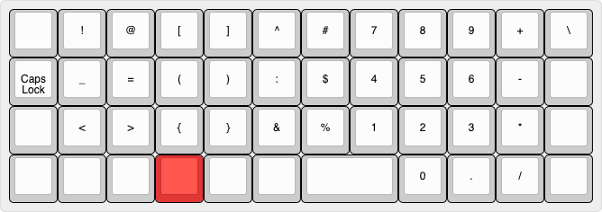
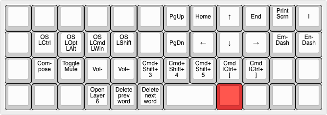
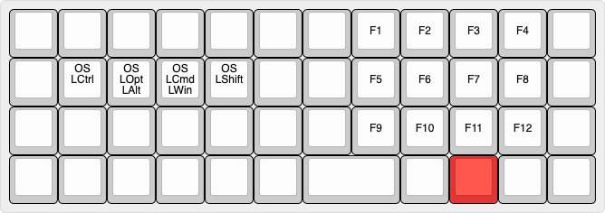

# ohshitgorillas' Drop x OLKB Planck rev7 Layout

## Physical Configuration
A green Planck rev7 keyboard from Drop using:
- Drop Jasmin MT3 ortho keycaps
- BSUN Maple Sugar switches
- steel plate
- all foams

## Base Layer

**Legend**: A short dash '-' indicates OS-specific differences (see [OS Awareness](#os-awareness)). A long em-dash '—' indicates tap-hold keys where the top legend is hold and bottom is tap.

The base layer uses an OS-aware standard QWERTY layout with Home Row Mods (HRMs), with the 2U spacebar shifted to the right to account for the fact that I hit space with my right thumb exclusively.

### Thumb Backspace and Delete
This is arguably the most transformative feature of the Planck layout. The transition from a traditional staggered keyboard to ortholinear is notoriously challenging—filled with typos, missed keys, and general frustration as muscle memory adapts to the new grid layout. Having dedicated backspace and delete keys accessible via the right thumb transforms this experience into something relatively manageable.

The ergonomic advantage cannot be overstated: instead of reaching up to the top-right corner with your pinky (often requiring hand repositioning), error correction becomes a simple thumb tap. This keeps your hands in the home position and maintains typing flow.

Beyond basic error correction, these thumb keys offer enhanced functionality when combined with the Raise layer. Holding Raise while pressing backspace or delete escalates the operation to word-level deletion—backspace becomes "delete previous word" and delete becomes "delete next word". This provides efficient text editing capabilities without leaving the home row or requiring complex key combinations.

### Tap-Hold Keys: Home Row Mods (HRMs) and Shift/Enter (SENT)
This layout uses two tap-hold configurations:
- **Shift/Enter (SENT)**: Hold for Shift, tap for Enter
- **Home Row Mods (HRMs)**: Modifiers on home row keys (Ctrl/Opt/Cmd/Shift)

HRMs and SENT require conflicting timing configurations. HRMs need conservative timing to avoid misfires during fast typing, while SENT needs aggressive timing to reliably activate Shift when holding other keys.

The core issue is that Shift as a HRM is problematic: unlike other modifiers (Ctrl, Cmd, Alt), Shift is frequently used mid-typing flow at high speeds. This makes HRM Shift prone to misfires that require extensive timing tuning to distinguish intent.

I prefer "dedicated" Shift keys to avoid this complexity—specifically a dedicated left Shift and SENT for the right side.

**HRM Configuration**:
- Uses `CHORDAL_HOLD` and `FLOW_TAP_TERM 150`
- Defaults to alpha keys unless clearly intending modifier use

**SENT Configuration**:
- Disables flow tap, uses 100ms tapping term
- `HOLD_ON_OTHER_KEYPRESS` for reliable Shift activation
- `RETRO_TAPPING` for reliable Enter activation
- Defaults to Shift unless tapped in isolation

### OS Awareness
This layout supports macOS and other OSes with minimal changes between systems.

The main challenge when switching between macOS and Windows/Linux is modifier key differences:
- **Key mappings**: macOS uses Ctrl/Opt/Cmd while Windows/Linux use Ctrl/Win/Alt (where Opt=Alt and Cmd=Win)
- **Usage patterns**: While Windows uses Ctrl for most shortcuts, macOS uses Cmd instead (e.g., cut/copy/paste becomes Cmd+ X, C, V)
- **Physical order**: Windows places Ctrl, Win, and Alt from the outside-in, while macOS uses Ctrl, Opt, and Cmd; because Opt=Alt and Cmd=Win, one system will be "out of order" without some form of OS-awareness.

The layout addresses this by replacing the bottom-right Cmd key with Ctrl when switching to Windows/Linux. While I could also swap Opt/Alt and Cmd/Win positions for consistency, I prefer keeping keys aligned with their printed labels rather than physically rearranging keycaps.

Other differences between OSes are in the Raise layer.

### Leader Sequences: Go to...
The following leader key sequences open or bring focus to the following apps:

- Q: WeChat
- W: WhatsApp
- T: Microsoft Teams
- A: Safari (for Android messaging over the web)
- S: Signal
- D: Discord
- F: Finder
- Z: Outlook
- X: Terminal
- C: Cursor
- B: Browser
- N: Calculator
- M: HQPlayer Client (music)

### Leader Sequences: Personal Information
The following leader key sequences print my personal information:

- P, E, M: personal email
- P, P, H: personal phone number
- W, E, M: work email
- W, P, H: work phone number
- A, D, D, R: my street address
- O, S, G: my DDNS address

### Leader Sequences: xcase
The following leader sequences activate [xcase](../../../modules/ohshitgorillas/xcase), which replaces spaces with a given delimiter.

- C, C: camelCase
- S, C: snake_case
- K, C: kebab-case
- X, C, any: uses the third character entered as a dynamic delimiter; e.g., "X, C, /" replaces/spaces/with/slashes

### SpongeMock Mode
The keyboard contains a QMK module called SpongeMock, which randOMlY CaPitaliZEs leTtERs to MimiC tHE sPONGEBob MOckING mEme. This is accessed via the Leader sequence S, M.

### Autocorrect Mode
The keyboard contains a custom autocorrect dictionary and mode which can be toggled via the leader sequence A, C.

I use this feature heavily with a custom library that I fill out as I make typos. This library can be found [here](../../../autocorrect).

While there are several exiting libraries out there for this kind of thing, most of them are focused on misspellings. I know how to spell, I just want to have my keyboard autocorrect *typos*.

## Lower: Numbers and Symbols

The Lower layer is responsible for numbers and symbols. On the right, a numpad-like configuration with 4 on the home-row J key makes numerical entry quick and efficient.

Symbol organization could be better, but it works for me.

Caps Lock is also hidden on this layer, under its traditional position to the left of A.

## Raise: Navigation

The Navigation layer uses IJKL as arrow keys, with ASDF as one-shot modifiers. YH are Page Up/Down, respectively; U and O are Home and End, respectively.

This layer also contains access to the following features:
- Compose key
- Mute/Volume controls
- Screenshot tools (Windows: Print Screen; macOS: Cmd+Shift+3,4,5)
- En- and Em-dashes (macOS: Opt+`-` and Shift+Opt+`-`, respectively)
- Code indent and unindent (Cmd|Ctrl+`[`,`]`)
- Delete previous and next words (Windows: Ctrl+Bksp,Del; macOS: Opt+Bksp,Del)

## Function Key Layer
 

The Function Key layer enables access to F keys, alongside one-shot modifiers. F keys are arranged in rows of four, with F5 under the home-row J key.

## Lighting Layer
The keymap also contains a final layer for controlling the lighting effects on the Planck along the home row. This is accessed by first holding Raise, then Lower. Chording Lower then Raise would simply result in outputting `0` due to the numpad layer placement.

I personally don't care for keyboard lighting, so I am content to keep the lights off.
