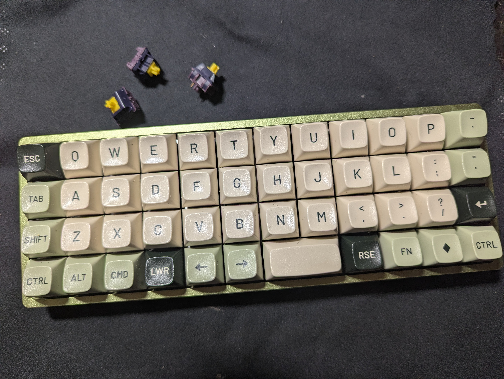

# Planck rev7 Ortholinear 40% Keyboard: A Review

I used the Planck keyboard for three weeks. Here are my unfiltered thoughts.

## Why would you do this to yourself? What's the point?

I got these questions a lot in various forms. And they are fair, to be honest. I genuinely frequently looked down at the Planck and asked myself the very same questions.

Some of you are already deep into this hobby and already use keyboards that most people would consider unusable abominations. You already get it. Those who aren't/don't... this review is for you.

There *are* reasons, but to understand them, we first need to start thinking about keyboards a bit differently. Let's begin by stepping down to 60% and slaying a sacred cow: the arrow keys.

### Fuck Arrow Keys
That's right, I said it. Go ahead: gasp, boo, hiss, clutch your fucking pearls.

To be clear, this isn't about *not having or using navigation features*: we all need to move the cursor around somehow. What you don't need are *dedicated* arrow keys.

Many of you are sitting in front of a standard full-size or TKL keyboard right now. These are very straightforward: if you want F5, you reach up and press the F5 key; if you want Print Screen, you reach over and press the Print Screen key. If you want the cursor to move up a line, you reach over and press the ↑ key. Easy peasy.

Here's a new way of thinking about this, though: all that reaching around the keyboard for different keys isn't just inefficient, it's poor ergonomics. What if the most critical functions were always right under your fingers on the home row?

Stop reaching and start chording.

This isn't groundbreaking: cut, copy, and paste are indispensable features that have never had dedicated keys on any standardized modern layout. You don't reach across the keyboard for a key, you *chord* Ctrl (or Cmd) + X, C, or V. Your fingers never leave the 40% portion of the keyboard. We're just applying that same logic to the arrow keys.

Hell, even that isn't revolutionary: gamers figured this out decades ago with `WASD`. Instead of reaching for dedicated arrow keys scattered around the keyboard, they put movement controls right under their left hand on the home row where they belong. It's faster, more ergonomic, and keeps your hand in a natural position. The same principle applies here: why reach for arrow keys when you can have navigation right under home row? The gaming world has been proving this works for years—we're just applying that wisdom to everyday typing and text editing. All it takes is a way to toggle that layer.

Next, take a look at your Caps Lock key: it's a useless little bitch taking up prime home row real estate. With the magic of programmable mechanical keyboards, we can transform it into a key that opens up a layer with things like Enter, Backspace, Delete, and yes, even arrow keys, all right on the home row.

This advice isn't for everyone, of course. Yes, it takes a little elbow grease to get there. Yes, it takes some retraining of your muscle memory... but for serious typists, the payoff can be significant. And fun to configure!

### The Keyboard Dark Arts
I'm a 60% user at heart. That's my sweet spot. The thought of using anything smaller as a daily driver is extremely unappealing: I write a fair amount of code, and I need easy access to numbers and symbols. At the same time, I don't need anything larger. I appreciate the more compact form factor and the extra desk space, and (as you can probably tell) I vastly prefer home row navigation to dedicated arrow keys. A 60% keyboard has all the keys I need and none that I don't.

So why the fuck did I buy a 40% keyboard? An ortholinear one, no less?

I'd hit a point of diminishing returns with my configuration. My setup was good, but I knew it could be better. I wanted more, but I had also reached the limits of my knowledge and capacity with the Vial software.

To get to the next level, I needed to go back to school. I saw the Planck as a ticket out of my comfort zone: a masterclass in constraint-driven design. By stripping away so many keys and adding thumb keys to (somewhat) compensate, the Planck forces you to fundamentally reconsider the layout. Where does Enter go? Backspace? Where's the fucking right Shift? How do you remember where all the symbols are‽‽

There are no easy answers, no one-size-fits-all solution. Not even close. The only way is a descent into the keyboard dark arts: the world of QMK, aka Quantum Mechanical Keyboard. This isn't just remapping keys and adding layers, it's an entire programming language for your keyboard. We're talking tap-hold and double/triple-tap timing intricacies, leader sequences that turn your keyboard into a command line, dynamic on-the-fly custom macros, and layering schemes so complex they'd make an Inception architect's head spin. The kind of things no sane person using a standard layout would ever want or need. The result is a layout that is custom-fitted like leather to each typist.

It's that knowledge I was after. The Planck wasn't just a keyboard: it was an internship, a trial by fire in these dark arts. A vision quest.

And this, my friends, is the crux of my reasoning for buying the Planck: sometimes you have to break something so that you can build it back better and stronger. I knew going in that this would be painful. I knew I'd hate it. But to truly master the 60%, I needed to go beyond it: I needed a keyboard that would force me to rethink the basics and teach me the the art of QMK.

And that's exactly what the Planck did.

## The Review Part of the Review
Look, I'm not going to reinvent the wheel here talking about the Planck's build quality—plenty of people have already beaten that horse to death. But since you're here, you get my takes anyway.

The build quality is aggressively meh... but so is the price, so I wasn't expecting much to begin with. The sound profile out of the box is, to put it politely, quite bad: hollow, metallic, and almost clangy. The foams helped considerably, but we're still a far cry from "good" as some hollowness lingers.

One gripe I will bring up is that the board has "eaten" a fair number of switches, meaning they never came off the plate in one piece. They were in so tight that they pulled apart rather than just coming loose. I've never had that happen before with any of my keyboards and it was genuinely frustrating. Really not a fan of that bullshit.

I tried both the POM and steel plates before settling on BSUN Maple Sugar switches on the steel plate. I used Drop's Jasmin MT3 Ortho keycaps.

## The Good Stuff
Let's cover what I really liked about the Planck. It wasn't all frustrations and typos.

### Thumb Keys Are the Light and the Way
Seriously, having so many keys for my thumbs instead of one giant spacebar is fucking *brilliant*. I love it.

I put a 2U spacebar on the right, since I almost exclusively use my right thumb. It was the perfect size—no more, no less than I needed. (My brief, disastrous experiment with a single-wide spacebar proved that.)

Anticipating (correctly) a steep learning curve with a fuckton of errors, I put Backspace and Delete as left-handed thumb keys. And it was fucking *glorious*! Hands down my single favorite feature of the Planck.

Think about it: your thumbs are incredibly agile and dexterous, yet on a standard keyboard one of them hits a single giant spacebar, usually in the same general spot, while the other floats around doing absolutely nothing. What a waste of real estate and talent!

With a traditional Backspace, when you make a mistake, you have to lift your right hand off the home row, reach over to the Backspace key, fix the error, then return to home. It's a constant, if minor, interruption to your flow if you have fat fingers. But with Backspace under my left thumb? I could correct errors instantly without ever breaking stride. My right hand stayed planted on the home row while my left thumb handled all the cleanup. I could even hold Raise with my right thumb, right next to the Spacebar, to turn those keys into "delete next/previous word."

The ergonomics are night and day better. No stretching, no reaching, no breaking your wrist position. It's one of those features that sounds minor on paper but transforms the entire typing experience once you've lived with it.

Fuck a giant spacebar, why isn't this standard? And why is it so hard to find a good 60% keyboard with split spacebar support?

### It's Fun to Configure
While using the Planck does feel sometimes like solving a damn Rubik's cube, the actual process of iterating over the layers and configuration is surprisingly fun. Type 2 fun, maybe, but fun nonetheless.

Here's the thing: I'm the type of person who gets genuinely excited about optimizing systems. I'll spend hours refactoring code just to make it more elegant, or lose myself in a complex puzzle for the pure satisfaction of finding the solution. The Planck tapped into that same part of my brain in a way my 60% boards never could.

With standard layouts, customization feels like rearranging furniture in a house someone else designed. You're mostly just remapping existing keys—maybe swapping Caps Lock for Control, or putting media controls under a function layer. It's useful, but it's not *creative*. There's no real *need* to rethink where Backspace goes because its default location, while arguably suboptimal, is good enough.

The Planck, on the other hand, is a blank canvas with impossible constraints.

Every key placement becomes a deliberate choice. Where do you put Enter when there's no dedicated place for it? Do you give up easy access to `'"` to put it on the home row, or do you move it down to share a key with Shift? What are the timing settings that allow Shift and Enter to share a key seamlessly for how I personally type? Or maybe we should leave Shift alone and Enter could be a thumb key? Each decision cascades into others, creating this intricate web of interdependent choices.

Every iteration felt like solving a design problem. I'd identify a pain point—say, I couldn't find underscore reliably, or I was having trouble accessing `Cmd+[` to un-indent code—then experiment with different solutions. Each solution would work for a while, then reveal new problems that needed solving.

It's the same dopamine hit I get from debugging a particularly gnarly piece of code or finally cracking a puzzle that's been stumping me for hours. The difference is that this puzzle was *mine*—every solution was tailored to my specific typing patterns, coding habits, and workflow quirks. No one else's layout would work for me, and mine wouldn't work for anyone else.

That iterative process of problem-solving and refinement? That's where the real magic happened.

Which leads me into my next point...

### QMK Is the Shiiiiiiiiit
Vial is good, but getting my hands dirty with QMK was a revelation in what's possible with a simple keyboard. This is the heart of the "dark keyboard arts" I was chasing.

If Vial is a moped that gets you around town, then QMK is a stripped-down Formula 1 car: insanely powerful, infinitely customizable, but demanding serious skill to master. If Vial is a Swiss Army knife, QMK is a fully-equipped machine shop where you can forge any tool you need... assuming you know how to operate a lathe.

I was resistant at first, sticking to the QMK Configurator and avoiding the C code... but that was a mistake. Once I dove in, I was hooked. The result is my [QMK userspace repository](https://github.com/ohshitgorillas/qmk_userspace), containing all my code, keymaps, and even a few community module contributions. For a detailed breakdown of the layout that resulted from this experiment, see the [layout README](README.md).

This experience cemented a new rule for me: no more non-QMK keyboards. I was seriously considering a Neo60 Cu until I realized I couldn't load it with QMK. That's a dealbreaker now. Having tasted the raw power of what a keyboard *can* be, I can't go back.

The only downside is that QMK doesn't support wireless, forcing most manufacturers to choose. For a business, the decision is easy—wireless sells more boards than QMK support. While I personally am perfectly content to sacrifice wireless functionality to get my hands dirty with C code (I actually *prefer* wired), I am obviously in the minority there. As a one-man business, I can respect many manufacturers' decisions to go with wireless; as an enthusiast, it's frustrating to now be locked out of so much of the market.

I know the odds are slim, but I hope to see a future where QMK and wireless can finally coexist.

### Comically Small
Finally, this thing is hilariously small. I have a fairly large desk with ample space for a full-sized board, so this thing just looks completely ridiculous in my setup. It makes my 60% boards feel like battleships. It's only twice the size of my mouse.

This translates to portability. Tossing it in a bag is an afterthought, and while I never took it anywhere, it would be the perfect coffee shop or travel board. You can have a decent typing experience on the go without lugging around a 15-pound block of aluminum and copper.

But for a die-hard ortho user, portability is more than just convenience. While your brain can store multiple keyboard layouts, it can only have one proficiently loaded into your RAM at a time. You cannot simply switch back-and-forth from ortho to staggered—it takes time and a storm of frustrating typos to readjust your muscle memory. For anyone fully committed to the ortho lifestyle, being able to bring your board with you on-the-go is a necessity.

## The Bad Stuff

Alright, let's get into the bullshit. It wasn't all fun and games, and some parts of this experiment were genuinely infuriating.

### The Humbling Experience of Typing Like an Idiot
There's no way to sugarcoat this: learning an ortholinear layout from scratch is a deeply humbling experience. You have to commit to being a shitty typist for a while, and it fucking sucks.

Your muscle memory is actively working against you, turning every word into a battle. The bottom row is by far the worst offender because all of the keys are a half unit off from where your fingers expect them. Every time I went to type a `c`, I'd hit `v` or `x` at the same time. The result was a constant stream of typos like `I really fuxcking sucvk at this`.

Even after three weeks, I never fully got comfortable. On Monkeytype, with just lowercase words, I clawed my way back to a respectable 110 WPM. But the moment I had to introduce punctuation—and note the lack of dedicated dash or parenthesis keys—you can take another 30 WPM off. Numbers? Cut the speed in half and double the errors. Outside of that, there were endlessly frustrating series of cascading mistakes: *Oops, that's a typo, where's th... oh, fuck, did I just hit tab? Undo that too. NO, NOT FORWARD DELETE, BACKSPACE. FUCK, THAT'S NOT THE GODDAMN BACKSPACE. FUCKING FUCK.*

Could I have given it more time and gotten back to full proficiency? Probably. But after three weeks, I felt I'd learned what I needed to and was ready to go back to my 60s.

Those of you who main these kinds of keyboards? Kudos. You have more patience, grit, and skill than I do. My 'internship' was difficult enough; I simply cannot imagine using something like this as a daily driver.

### The Constant Mental Overhead is Exhausting
Beyond the physical clumsiness, the mental load of using the Planck for any real work was exhausting. A standard keyboard is transparent; you don't *think* about where the keys are, you just type. The Planck was the opposite: a constant puzzle I had to solve just to get my thoughts onto the screen.

It doesn't sound like much, but the constant cognitive friction of going, "*Okay, there's the dash, and there's the open parenthesis, and... no, backspace, now here's the... fuck, that's not it either, THERE's the open parenthesis... now we need an underscore... ope, wrong layer*" takes its toll. All those little micro-interruptions are murder on your flow state. When you're deep in a coding problem or trying to articulate a complex idea, the last thing you want is to be derailed by figuring out how to chord `Ctrl + Opt + \` or some shit.

It wasn't until I switched back to my 60% that I realized just how much mental energy I was expending. The feeling of just hitting number and symbol keys without a second thought was incredibly freeing.

### It's Cheap (and That's Okay)
Let's be clear: the Planck is an entry-level board, and at $99 for the base kit, the price is fair. It wouldn't have made any sense for me to drop $500 on a keyboard intended as an educational detour. I needed a tool for a temporary job, and for that, the Planck was a great choice. It delivered a decent typing experience for my "internship" without breaking the bank.

That being said, coming from a premium board like the LX60 Copper Edition—whose kit cost three times the Planck's—or even the Tofu60 2.0, the difference is stark. These are admittedly unfair comparisons, but it's what I have, and it highlights what you give up at this price point.

The main thing is the feel. I'm used to keyboards that could double as bludgeoning tools. My Tofu60 2.0 is also a budget board, but it's a dense block of aluminum that feels like a serious instrument. The Planck, by contrast, feels like a toy.

While its weight, or lack thereof, is a huge plus for portability, it feels flimsy and insubstantial at a proper workstation. It slides around and sounds like complete ass without foams (and still not great with). For someone who appreciates the tactile and aesthetic presence of a well-built keyboard, it was a constant, if only mild, disappointment.

## So, What Did I Learn?
This whole experiment was about pushing my boundaries and seeing what was on the other side. The Planck was a difficult, frustrating, and ultimately invaluable teacher. Here's what I'm taking with me:

### QMK Is Cool and Good
QMK is not just about remapping keys and layers: it's a fundamental reimagining of what a keyboard can do.

For example, take the Leader key, which turns your keyboard into a command line:
- `Leader` `P` `E` `M` prints my personal email.
- `Leader` `W` `E` `M` prints my work email.
- `Leader` `S` `M` tOgGLes aUToMated spONGEBOB mOckiNg TExt mOdE.

Then there's my [implementation of xcase](https://github.com/ohshitgorillas/qmk-xcase). Say I need to type an obnoxiously long file path. I hit `Leader` `X` `C` `/` and suddenly all/of/my/spaces/turn/into/slashes. But:the:fun:doesn't:stop:there! Anything|can|replace|spaces! IcanEVENtoggleCAPSlockONandOFFwithTHEspacebarTOtypeLIKEthis!

And having autocorrect at the firmware level, everywhere I type? Beautiful. I cannot tell you how many times a day I type 'teh'.

### Mastering Dual-Key Timing is a Superpower
This was the holy grail for me. I'd struggled for ages in Vial to get a dual-function Caps Lock key that worked reliably—one that could serve as a lightning-fast layer key on hold but still function as a normal Caps Lock on tap. It just wasn't possible; there was too much overlap between tapping and holding. I eventually settled for turning Caps Lock into a dedicated layer key, with the literal Caps Lock feature accessed via a combo. It was functional, but not great.

As it turns out, solving this problem required the full arsenal of QMK's advanced timing features. Nailing the precise combination of `TAPPING_TERM`, `HOLD_ON_OTHER_KEY_PRESS`, and `RETRO_TAPPING` felt like cracking a code. The result is flawless: I can trigger the layer in tens of milliseconds for rapid-fire Backspace from the home row *and* reliably activate Caps Lock on a tap. No misfires, ever.

This single victory made the entire painful experiment worth it.

### Home Row Mods Are the Shit
This is a genuine revelation and one of those 'out of the box' ideas that I would never have been exposed to had I not picked up the Planck. Having modifiers on the home row keys is a massive ergonomic and efficiency boost, and I'm never going back.

For those who are unfamiliar, here's the gist. Each of your eight home keys (`ASDF` and `JKL;`) has two jobs: when you tap it, it prints the character; when you hold it, it acts as a modifier. For my keyboards, `A` and `;` are Ctrl, `S` and `L` are Opt, `D` and `K` are Cmd, and `F` and `J` are Shift.

If this sounds like a horrific idea that would interrupt your typing flow constantly... you're not wrong. Getting the timing right requires some finesse—your keyboard needs to reliably distinguish between a tap and a hold. For Ctrl, Opt, and Cmd, this is relatively straightforward. Shift, however, is a different beast and entirely dependent on how you type. Since Shift is used so frequently mid-word (for capitals, symbols, etc.), the timing requirements become incredibly precise. Unless you're willing to invest significant time fine-tuning the settings to match your exact typing rhythm and speed, I'd recommend avoiding Shift as a Home Row Mod except for consistency with chording.

Even ignoring Shift, think about how often you use modifiers. Every copy, paste, and shortcut requires you to contort your fingers into an unnatural position to reach Ctrl or Cmd. Home Row Mods eliminate that entirely. The modifiers are already right under your fingers at all times. Instead of reaching down for Command with one hand and tapping `C` with the other, I just hold `K` and tap `C`. It's faster, more comfortable, and dramatically reduces hand strain. It's one of those changes that feels so right, you'll wonder how you ever tolerated the old way.

### The Nuance of ABS in MT3
I do not like shined keycaps—the 'stickiness' bothers me—so I've always stayed away from ABS. Give me a fresh, rough batch of PBT any day.

For this board, I broke that rule and went with Drop's Jasmin MT3 keycaps in ABS. I was mostly curious about the MT3 profile, and I figured I wouldn't use the board enough to fully shine the caps by the time my "internship" was over.

The keycaps are lightly shined, but still in good shape.

And I'm a big fan of MT3. The scooping is super comfy. And honestly? It makes the shine less of an issue for me. I could see myself running a set of MT3 ABS until I could see my own reflection in them. I'd still prefer to see Drop offer more MT3 in PBT, but I'm no longer an absolutist.

### 60% is My Home
This experiment solidified it for me. The Planck was a fun, educational, and occasionally infuriating detour, but 60% is where I belong. I need my number row, and I need a layout that doesn't make me feel like I'm solving a puzzle every time I need to type a fucking backslash.

The Planck wasn't a failure; it was a vision quest. It forced me to learn, adapt, and master new skills. It taught me the true power of QMK and revealed the ergonomic benefits of Home Row Mods. I'm returning to my 60% boards not because the Planck was bad, but because it gave me the knowledge I needed to make my preferred layout even better. I'm glad to be back, but I'm also grateful for the journey.

And I'm really going to miss having Backspace under my thumb.
